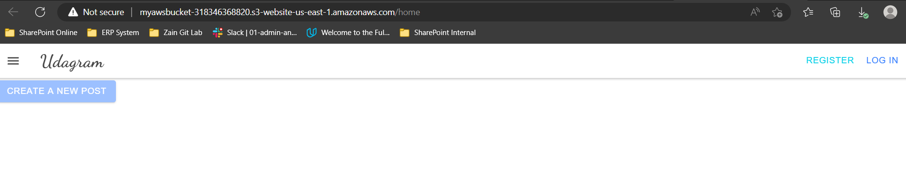
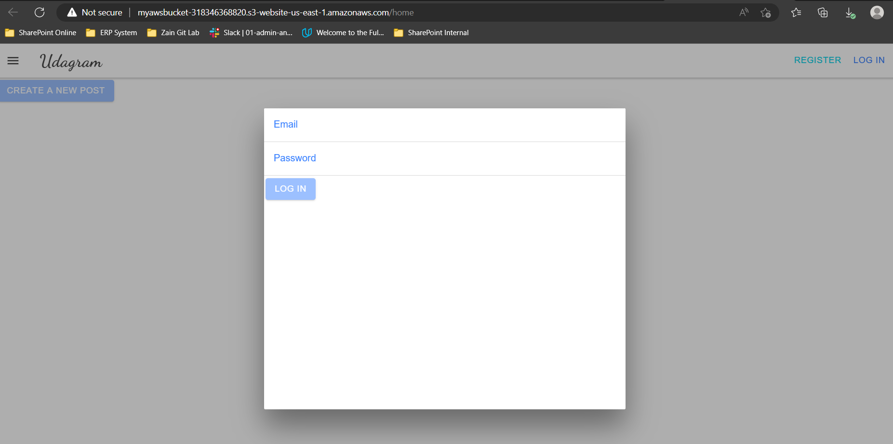
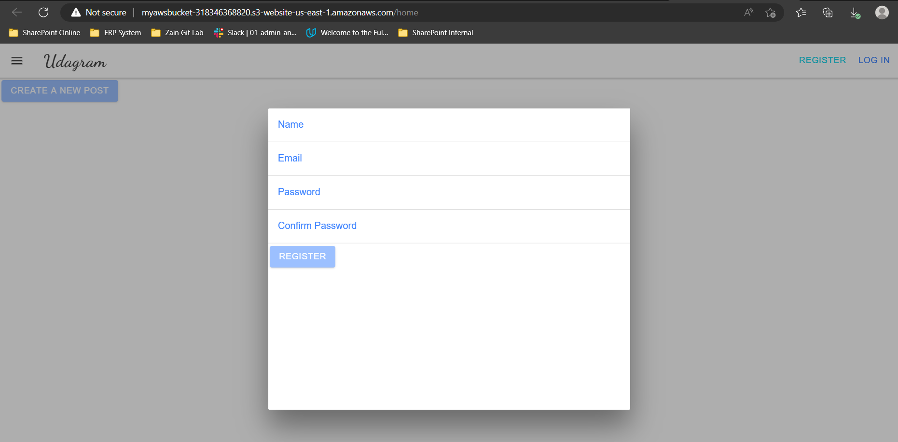
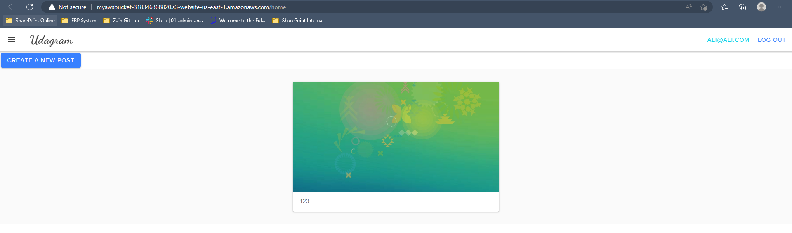
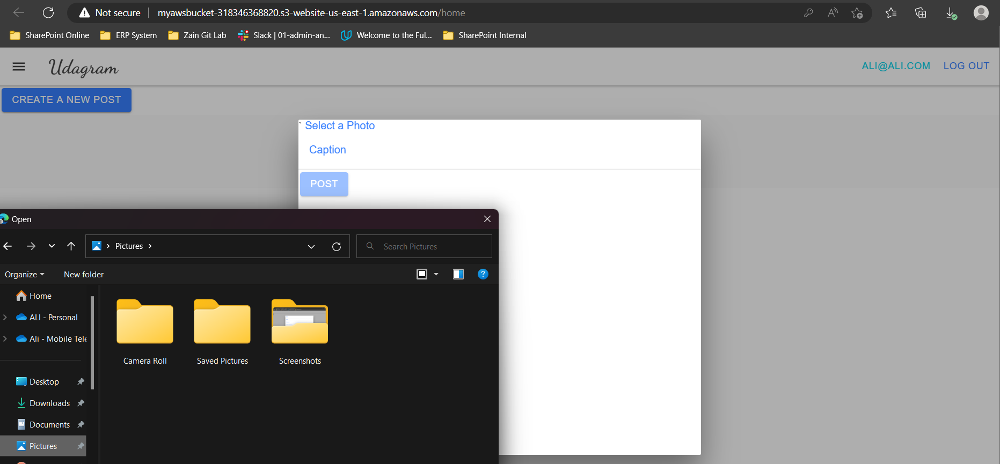

# Hosting a Full-Stack Application

This repository is the final project in the [React Nanodegree program](https://www.udacity.com/course/react-nanodegree--nd019).

## Project overview

Udagram is an application to post and share images, users should have account to sign-in if already have an account or sign-up as new user to be able to post images.

## Software and Tools

### Built with:

1. [Angular](https://angular.io/) : The Front-end - Single Page Application Framework.
2. [Express](https://expressjs.com/) : The Backend-end - Javascript API Framework.
3. [Node](https://nodejs.org/en/) : An open-source, cross-platform JavaScript runtime environment.

### AWS Services to be included:

1. [RDS](https://aws.amazon.com/rds/) : Database as `postgres` for hosting.
2. [S3](https://aws.amazon.com/getting-started/hands-on/host-static-website/) : Bucket as `host static website` - Front-end.
3. [EB](https://docs.aws.amazon.com/elasticbeanstalk/latest/dg/GettingStarted.html) : Elasticbeanstalk as an `api` - Back-end.

## Dependencies
```bash
- Node v14.15.1 (LTS) or more recent. While older versions can work it is advisable to keep node to latest LTS version

- npm 6.14.8 (LTS) or more recent, Yarn can work but was not tested for this project

- AWS CLI v2, v1 can work but was not tested for this project

- A RDS database running Postgres.

- A S3 bucket for hosting uploaded pictures.
```
# Getting Started
## Installation
### Home page

- User need to sign-up as new user or sign-in if alrady have account:

[Click Here](http://myawsbucket-318346368820.s3-website-us-east-1.amazonaws.com)



### Sign-in Form

- User should fill the correct email and password to log-in to the website:



### Sign-up Form

- User should pass tha validation for the form and meet the requirments to creat new account:



### Creating New Post

- user can not create new post without sign-in.





## Testing
This project contains two different test suite: unit tests and End-To-End tests(e2e). Follow these steps to run the tests.
```bash
    1. cd starter/udagram-frontend
    2. npm run test
    3. npm run e2e
```

There are no Unit test on the back-end

### Unit Tests:
Unit tests are using the Jasmine Framework.

### End to End Tests:
The e2e tests are using Protractor and Jasmine.

## Documentations:

- All screenshot can be found in [Assets > ScreenShot](/assets/screenshot/)
- Deployment steps can be found in [Docs > Deployment Process](/Docs/Deployment%20Process.md)
- Infrastructure Description can be found in [Docs > Infrastructure Description](/Docs/Infrastructure_description.md)
- Pipeline Description can be found in [Docs > Pipeline Description](/Docs/Pipeline_description.md)

## Licenses and Referances
- [License](https://github.com/udacity/nd0067-c4-deployment-process-project-starter/blob/master/LICENSE.txt)
- [Referance](https://github.com/udacity/nd0067-c4-deployment-process-project-starter)

